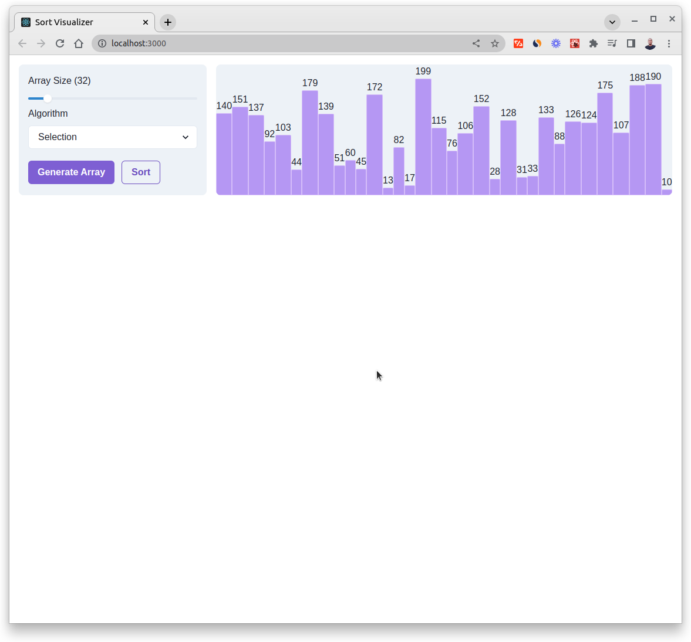
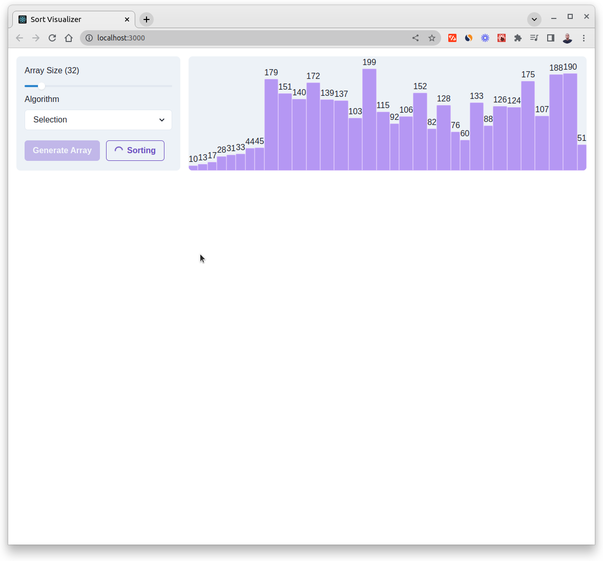
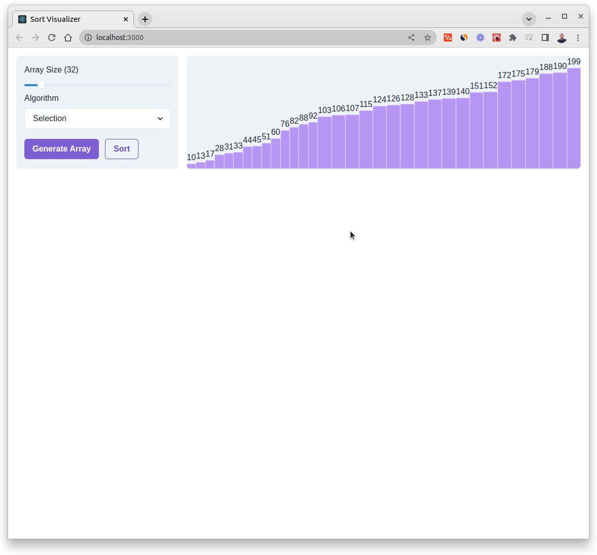

# Sort Visualizer

[](https://reactjs-sort-visualizer.netlify.app/)

[](https://reactjs-sort-visualizer.netlify.app/)

[](https://reactjs-sort-visualizer.netlify.app/)

This is a Sort Visualizer guide on how sorting works behind the scenes.

## Technologies

- React
- Chakra-UI

## Algorithms

- Sorting

## Sorting Techniques

- Selection
- Insertion
- Linear

## Setup

```code
# Clone this repo
git clone  https://github.com/hesbon-osoro/sort-visualizer.git

# Navigate to directory and install packages
cd  sort-visualizer && yarn

# Start the App
yarn start
```
